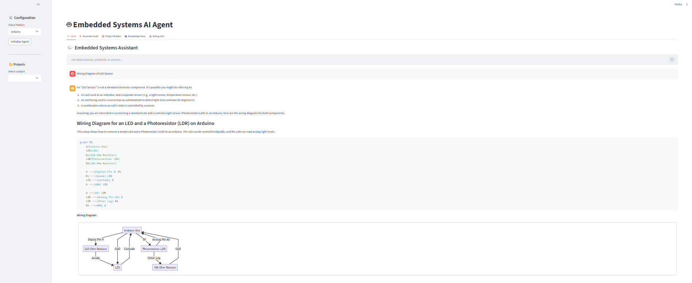

# This is a README file for my Final Year Major Project entitled "Generarive AI Copilot for Embedded Software"

1. THe current files which have the major work are agent_temp.py and temp.py.
2. To run the script firt do the following steps:
    - First create a virtual environment.
    - pip install -r requirements.txt there.
    - clear the terminal.
    - run the streamlit app as: streamlit run temp.py
    - Replace the GEMINI API if exhausted.

3. Screenshot Below:

| Dashboard of Embedded Copilot |
| :--------: | :------------: | :---------: |
|  |

---
## ----WORK IN PROGRESS----